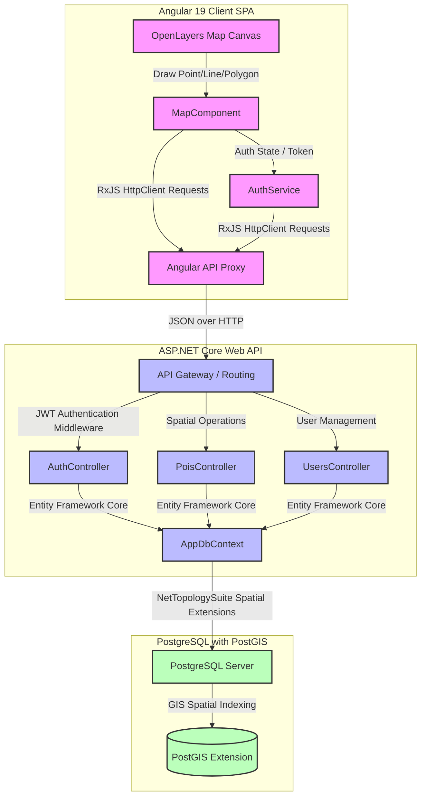
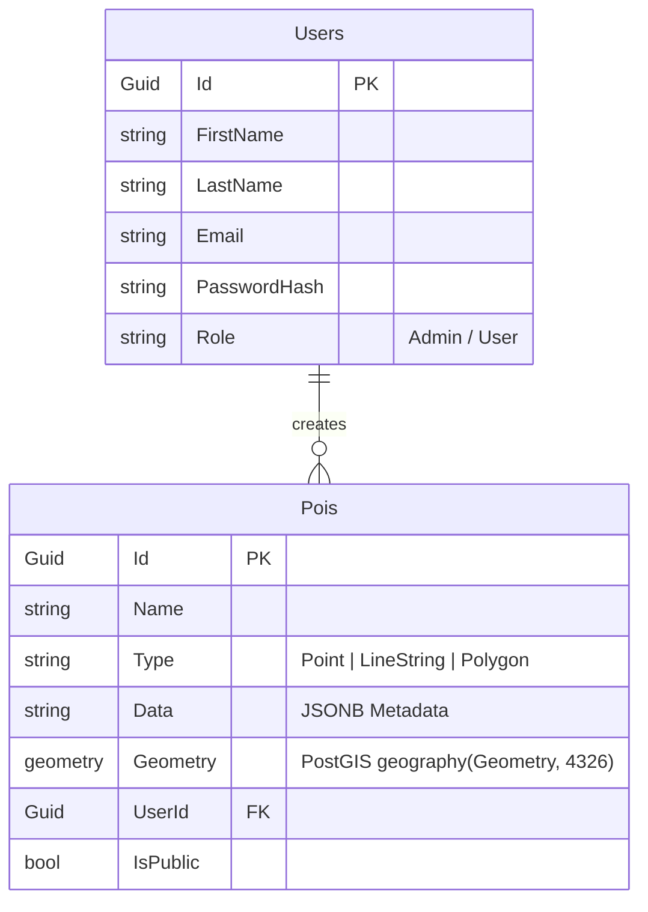

# 🗺️ BankMapApp: High-Performance Enterprise GIS & POI Analytics Platform

[](https://learn.microsoft.com/en-us/dotnet/csharp/)
[](https://dotnet.microsoft.com/en-us/)
[](https://angular.dev/)
[](https://www.postgresql.org/)
[](https://openlayers.org/)

**BankMapApp** is an enterprise-grade Geographic Information System (GIS) and Point-of-Interest (POI) management platform. Built using a modern decoupled architecture, it leverages **ASP.NET Core Web API 8.0** on the backend and **Angular 19** on the frontend, powered by **PostgreSQL** with the **PostGIS spatial database extension** and **OpenLayers** for real-time interactive mapping.

The application allows authorized users to draw, store, and query complex geographic spatial features (Points, LineStrings, Polygons) on a live vector map layer, using industry-standard **EPSG:3857** map projecting and **EPSG:4326 (WGS84)** data serialization.

---

## 🏗️ System Architecture



---

## 💾 PostGIS Entity Relationship Diagram (ERD)



---

## 🚀 Key Features

*   **⚡ Live Spatial Vector Drawing**: Seamlessly draw Points (bank branches/ATMs), LineStrings (routes), and Polygons (service regions) directly on the interactive map interface using OpenLayers.
*   **🌍 Precision PostGIS Engine**: Persistent storage of spatial features using the **PostgreSQL PostGIS spatial database engine** via **NetTopologySuite** integration in Entity Framework Core.
*   **🔒 Secure JWT Authentication**: Robust authentication system with JSON Web Tokens (JWT) protecting core REST endpoints, complete with dynamic client-side route guards.
*   **👥 Role-Based Access Control (RBAC)**: Supports `Admin` and `User` roles with granular visibility controls—Admins can manage all geographic entities, while standard Users interact within their secure tenant boundary.
*   **📦 RESTful API Service Architecture**: Features decoupled controller structures with database transactions, dependency injection (DI), and generic repository patterns.

---

## 🛠️ Technology Stack

| Layer | Technology | Purpose |
| :--- | :--- | :--- |
| **Backend Framework** | ASP.NET Core Web API 8.0 | High-performance, cross-platform microservice engine |
| **GIS Data Mapper** | NetTopologySuite | Integrates industry-standard OpenGIS spatial types into EF Core |
| **ORM Engine** | Entity Framework Core | Database queries, spatial mappings, and transaction safety |
| **Database** | PostgreSQL + PostGIS | Highly efficient relational database with spatial coordinate indexes |
| **Frontend Framework** | Angular 19 | Scalable component-based SPA architecture |
| **GIS Engine** | OpenLayers (ol) | Renders canvas vector drawing controls and OSM base map tiles |
| **Security Layer** | JWT (JSON Web Tokens) | Stateless authorization and cryptographically signed session validation |
| **Password Hashing** | BCrypt.Net-Next | Secure password storage using adaptive blowfish salting |

---

## 📡 REST API Reference

All requests must supply the header `Authorization: Bearer <JWT_TOKEN>` unless the endpoint is marked as public.

### Authentication Endpoints
| HTTP Method | Route | Description | Authentication |
| :--- | :--- | :--- | :--- |
| `POST` | `/api/auth/register` | Registers a new user account | Public |
| `POST` | `/api/auth/login` | Authenticates credentials and returns a JWT | Public |

### Users Management Endpoints
| HTTP Method | Route | Description | Authentication |
| :--- | :--- | :--- | :--- |
| `GET` | `/api/users` | Returns a list of all registered users | Admin-Only |
| `GET` | `/api/users/{id}` | Fetches a specific user profile by their ID | Admin-Only |

### Points of Interest (POIs) Endpoints
| HTTP Method | Route | Description | Authentication |
| :--- | :--- | :--- | :--- |
| `GET` | `/api/pois` | Fetches a filtered list of all visible POIs | User / Admin |
| `POST` | `/api/pois` | Persists a new drawn POI with geographic coordinates | User / Admin |
| `PUT` | `/api/pois/{id}` | Updates name, description, coordinates or metadata of a POI | Authorized User / Admin |
| `DELETE` | `/api/pois/{id}` | Deletes a spatial POI from the database | Authorized User / Admin |

---

## ⚙️ Setup & Installation Instructions

### 1. Prerequisites
Ensure you have the following installed on your machine:
*   [.NET 8.0 SDK](https://dotnet.microsoft.com/en-us/download/dotnet/8.0)
*   [Node.js (v18 or higher)](https://nodejs.org/) & `npm`
*   [PostgreSQL Database Server](https://www.postgresql.org/download/)
*   [PostGIS Spatial Extension](https://postgis.net/install/)

### 2. Database Configuration
Enable PostGIS on your PostgreSQL server and execute the migrations:
1. Connect to your PostgreSQL instance using pgAdmin or psql.
2. Create a new database named `BankMapDb` and run the following command to activate the spatial extension:
   ```sql
   CREATE EXTENSION postgis;
   ```
3. Open `BankMapApp.Server/appsettings.json` and configure your database connection string:
   ```json
   "ConnectionStrings": {
     "DefaultConnection": "Host=localhost;Database=BankMapDb;Username=postgres;Password=YOUR_PASSWORD"
   }
   ```

### 3. Running the Backend Web API
1. Navigate to the server folder:
   ```bash
   cd BankMapApp.Server
   ```
2. Restore package dependencies and apply database migrations:
   ```bash
   dotnet ef database update
   ```
3. Boot up the developer backend API:
   ```bash
   dotnet run
   ```
The Swagger UI will launch automatically at `https://localhost:5069/swagger/index.html`.

### 4. Running the Frontend SPA Client
1. Navigate to the client folder:
   ```bash
   cd bankmapapp.client
   ```
2. Install standard Node dependencies:
   ```bash
   npm install
   ```
3. Start the Angular local development server:
   ```bash
   npm start
   ```
The client dashboard will be live at `http://localhost:4200/`.

---

## 💼 Internship Context & Credits

This project was successfully designed and developed as an internship project at **Noda Bilişim Teknolojileri**.

### 🤝 Special Acknowledgments
I would like to express my sincere appreciation and gratitude to:
*   **Batuhan Çitoğlu** (CTO & Internship Mentor) — For his invaluable technical mentorship, architectural guidance, design reviews, and constant support throughout my development journey.
*   The entire engineering team at **Noda Bilişim Teknolojileri** for providing a highly collaborative corporate environment.

---

## 💎 Portfolio Showcase
This project serves as a showcase of solid fullstack engineering principles, including:
*   **GIS Engine Integrations**: Custom vector canvas drawing using OpenLayers.
*   **Spatial Database Design**: Working with geography data types, spatial projections (EPSG:3857/4326), and indexing inside PostgreSQL / PostGIS.
*   **Enterprise Architecture**: Decoupled C# ASP.NET Core API design backed by a modern Angular 19 client SPA.
*   **Clean Code Practices**: Strict division of concerns, service abstractions, and robust JWT-based role protection.

Feel free to explore the codebase and fork the repository!
